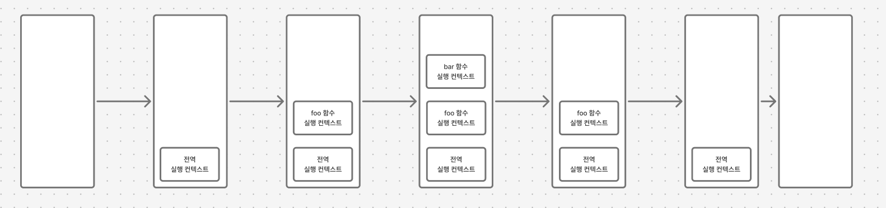

# 클로저

> 클로저는 함수와 그 함수가 선언된 렉시컬 환경의 조합이다.
https://developer.mozilla.org/en-US/docs/Web/JavaScript/Guide/Closures
>

즉, 클로저는 어떤 함수가 선언될 당시의 Scope(Lexical Environment)를 기억하고, 함수가 실행되는 시점에도 그 Scope에 접근할 수 있는 구조

이를 구현하기 위해 JS 엔진은 함수를 실행할 때마다 **Environment Record** 라는 내부 객체를 생성해 변수/함수 선언을 저장하고, 상위 스코프와 연결한다(Scope Chain).

클로저를 이해하기 위해선 렉시컬 스코프, 실행 컨텍스트와 렉시컬 환경, 환경 레코드, 스코프 체인을 알아야 한다.

## 렉시컬 스코프 (Lexical Scope)

> 함수가 어디서 정의되었는가에 따라 변수의 유효 범위가 결정되는 것.
실행 위치가 아니라 정의 위치가 스코프를 결정한다.
>

```jsx
function init() {
  var name = "장민수"; // init 함수 내에서 생성된 지역 변수
  
  function displayName() {
  // displayName()은 내부 함수이며, 클로저
    console.log(name); // 부모 함수에서 선언된 변수를 사용
  }
  displayName();
}

init();
```

위 코드에서 displayName() 이라는 함수는 init() 내부에서 정의된 함수이며, 외부에선 사용할 수 없다.

displayName() 함수의 특이한 점은 자신의 지역 변수가 존재하지 않으나 name 변수에 접근하고 있다.

> 이는 함수가 어디서 ‘실행’ 되는지가 아니라, 어디서 ‘정의’ 되었는가에 따라 변수 접근 가능 범위가 결정되는 렉시컬 스코프 규칙 때문이다.
>


예시를 실행하면 다음과 같이 정상적으로 name을 표시한다.

### Lexical의 의미

‘Lexical’ 이란  lexical scoping 과정에서 변수가 어디서 사용 가능한지 알기 위해 해당 변수가 소스코드 내 어디에 선언되었는지 고려한다는 것을 의미. 따라서 중첩된 함수(displayName 같은)는 외부 범위 정의된 변수에 접근할 수 있다.

정리하면, ‘Lexical’은 코드의 위치에 따라 스코프가 결정되며, 코드가 작성된 구조가 변수 접근 가능 범위를 결정한다.

<aside>
💡 쉽게 말해, ‘코드가 어디에서 정의되었는가’로 변수의 유효 범위를 결정하는 개념

</aside>

### 그렇다면 누가 변수 선언 위치를 기억하고 있는가?

정답은 parser이다. 자바스크립트 엔진의 parser는 코드를 읽는 파싱 단계에서 각 변수와 함수의 선언 위치(스코프 구조)를 분석하고, 이를 AST(Abstract Syntax Tree) 형태로 기록한다.

이렇게 기록된 스코프 구조는 이후 실행 컨텍스트와 환경 레코드로 실체화되어 런타임에 변수 접근 관리

이렇게 렉시컬 스코프는 어떤 변수를 어디서 참조할 수 있는가를 결정하는 정적 규칙이라 볼 수 있다.

그렇다면 이 규칙에 따라 실제 코드 실행은 어떻게 이루어지며, 실제 메모리 내부에서는 어떠한 구조가 만들어지는가?

이를 알아보기 위해 먼저 실행 컨텍스트에 대해 알아보자.

## 실행 컨텍스트 (Execution Context)

실행 컨텍스트는 소스코드 실행에 필요한 환경을 제공하고, 실행 결과를 실제 관리하는 환경

구체적으로 식별자(변수, 함수, 클래으 등의 이름)를 등록하고 관리하는 스코프와 코드 실행 순서 관리를 구현한 내부 메커니즘으로, 모든 코드는 실행 컨텍스트를 통해 실행되고 관리됨

자바스크립트의 동작 원리를 담는 핵심 개념, 이를 통해 자바스크립트가 스코프를 기반으로 식별자와 식별자에 바인딩된 값을 관리하는 방식, 호이스팅이 발생하는 이유, 클로저의 동작 방식, 태스크 큐와 함께 동작하는 이벤트 핸들러, 비동기 처리의 동작 방식을 이해 가능

### 소스코드 타입

ECMAScript 사양은 소스코드를 4가지 타입으로 구분하며 각 소스코드는 실행 컨텍스트를 생성

| 소스 코드 타입 | 설명 |
| --- | --- |
| 전역 코드 | 전역에 존재하는 소스코드. 전역에 정의된 함수, 클래스 등의 내부 코드는 포함X |
| 함수 코드 | 함수 내부에 존재하는 소스 코드. 내부에 중첩된 함수, 클래스 등의 내부 코드는 포함X |
| eval 코드 | 빌트인 전역 함수인 eval 함수에 인수로 전달되어 실행되는 소스코드 |
| 모듈 코드 | 모듈 내부에 존재하는 소스코드. 모듈 내부의 함수, 클래스 등 내부 코드 포함X |

| 실행 컨텍스트 종류 | 설명 |
| --- | --- |
| 전역 컨텍스트 | JS가 처음 실행될 때 한 번만 생성. 전역 객체(window, globalThis 등)와 연결됨 |
| 함수 컨텍스트 | 함수가 호출될 때마다 새로 생성. 각각 독립적인 실행 환경을 가짐 |
| Eval 컨텍스트 (거의 사용 X) | eval() 호출 시 만들어짐 |
| 모듈 컨텍스트 | 전역 컨텍스트가 만들어진 후 각 모듈이 로드될 때 생성. 각 모듈은 파일 단위로 하나의 실행 컨텍스트를 가짐 |


### 소스코드의 평가와 실행

자바스크립트 엔진은 모든 소스코드를 2개의 과정을 거쳐 처리

‘소스코드의 평가’, ‘소스 코드의 실행’으로 나누어 처리


평가 과정에서 실행 컨텍스트를 생성하고 변수, 함수 등의 선언문만 먼저 실행한다. 그 다음 생성된 변수나 함수 식별자를 키 설정하여, 실행 컨텍스트가 관리하는 스코프에 등록한다.

평가 과정이 끝나면 선언문을 제외한 소스코드를 순차적으로 실행 시작 ← 런타임

이때 소스코드 실행에 필요한 정보, 즉 변수나 함수의 참조를 실행 컨텍스트가 관리하는 스코프에서 검색해서 취득한다. 그리고 변수 값의 변경 등 소스 코드의 실행 결과는 다시 실행 컨텍스트가 관리하는 스코프에 등로된다.

예를 들어 다음과 같은 소스 코드가 실행

```jsx
var x;
x = 1;
```

JS 엔진은 위 코드를 2개의 과정으로 나누어 처리.

**소스 코드 평가**


먼저 평가 과정에서 변수 선언문 var x;를 먼저 실행

이때 생성된 변수 식별자 x는 실행 컨텍스트가 관리하는 스코프에 등록되고 undefined로 초기화

**소스 코드 실행**


평가 과정이 끝나면 실행 과정 시작.

var x;는 평가 과정에서 이미 실행 완료되었음. 따라서 소스코드 실행 과정에서는 변수 할당문 x = 1;만 실행됨, 이때 변수에 값을 할당하려면 먼저 x변수가 변수인지 확인 필요

이를 위해 실행 컨텍스트가 관리하는 스코프에 x 변수가 등록되어 있는지 확인. 만약 x 변수가 실행 컨텍스트가 관리하는 스코프에 등록되어 있다면 x 변수는 선언된 변수, 즉 평가 과정에서 선언문이 실행되어 등록된 변수

x변수가 선언된 변수라면 값을 할당하고 결과를 실행 컨텍스트에 등록하여 관리

### 실행 컨텍스트 스택

```jsx
const x = 1;

function foo() {
  const y = 2;
  
  function bar () {
    const z = 3;
    console.log(x + y + z);
  }
  bar();
}

foo(); // 6
```


위 예제는 전역 코드와 함수 코드로 이루어져 있음. JS 엔진은 다음과 같이 실행 컨텍스트를 생성.

1. 전역 코드를 평가하고 전역 실행 컨텍스트를 생성
2. 함수가 호출되면 함수 코드를 평가하여 함수 실행 컨텍스트 생성

> 이때 실행된 컨텍스트는 Stack 자료구조로 관리되며, 이를 실행 컨텍스트 스택이라고 부름
>

위 코드를 실행하면 시간의 흐름에 따라 실행 컨텍스트는 다음과 같이 실행 컨텍스트가 추가(push)되고 제거(pop)됨.



1. **전역 코드의 평가와 실행**
    - JS 엔진은 먼저 전역 코드를 평가하여 전역 실행 컨텍스트 생성해 실행 컨텍스트 스택에 Push
    - 이때 전역 변수 x와 전역 함수 foo는 전역 실행 컨텍스트에 등록
    - 전역 코드가 실행되 시작하여 전역 변수 x에 값이 할당되고 전역 함수 foo가 호출
2. **foo 함수 코드의 평가와 실행**
    - 전역 함수 foo가 호출되면 전역 코드 실행 일시 중단되고 코드의 제어권이 foo 함수 내부로 이동
    - JS 엔진은 foo 함수 내부의 함수 코드를 평가하여 foo 함수의 실행 컨텍스트를 생성하고 실행 컨텍스트 스택에 Push
    - 이때 foo 함수의 지역 변수 y와 중첩 함수 bar가 foo 함수 실행 컨텍스트에 등록됨
    - 이후 foo 함수 코드가 실행되기 시작하여 지역 변수 y에 값이 할당되고 중첩 함수 bar가 호출됨
3. **bar 함수 코드의 평가와 실행**
    - 중첩 함수 bar가 호출되면 foo 함수 코드의 실행은 일시 중단되고 코드의 제어권이 bar 함수 내부로 이동
    - JS 엔진은 bar 함수 내부 코드를 평가해 bar 함수 실행 컨텍스트를 생성하고 실행 컨텍스트 스택에 푸시
    - 이때 bar 함수의 지역 변수 z가 bar 함수 실행 컨텍스트에 등록됨
    - bar 함수 코드가 실행되기 시작, 지역 변수 z에 값 할당되고 console.log 메서드 호출 이후 bar 함수 종료
4. **foo 함수 코드로 복귀**
    - bar 함수가 종료되면 코드의 제어권은 다시 foo 함수로 이동
    - 이때 JS 엔진은 bar 함수 실행 컨텍스트를 실행 컨텍스트 스택에서 Pop하여 제거
    - foo 함수는 더 이상 실행할 코드가 없으므로 종료
5. **전역 코드로 복귀**
    - foo 함수 종료 후 코드 제어권이 전여 코드로 이동
    - JS 엔진은 foo 함수 실행 컨텍스트를 실행 컨텍스트 스택에서 Pop
    - 더 이상 실행할 전역 코드가 남아 있지 않으므로 전역 실행 컨텍스트도 실행 컨텍스트 스택에 Pop되어 실행 컨텍스트는 비게 됨

이처럼 실행 컨텍스트 스택은 코드의 실행 순서를 관리

소스코드가 평가되면 실행 컨텍스트가 생성되고 실행 컨텍스트 스택 최상위에 쌓임

실행 컨텍스트 스택의 최상위에 존재하는 실행 컨텍스트는 언제나 현재 실행 중인 코드의 실행 컨텍스트

따라서 실행 컨텍스트 스택의 최상위에 존재하는 실행 컨텍스트를 실행 중인 실행 컨텍스트라 부름

### 중간 정리

| 단계 | 개념적 역할 | 시점 | 연결 관계 |
| --- | --- | --- | --- |
| 렉시컬 스코프 | ‘변수를 어디서 참조할 수 있는가’를 결정하는 정적 규칙 | 파싱 단계 | 파서가 스코프 구조를 결정 |
| 실행 컨텍스트 | 실제 코드 실행 단위(전역/함수/모듈 등) | 실행 시 생성 | 각 코드 블록이 실행될 때마다 컨텍스트 생성 |

지금까지 실행 컨텍스트를 통해 ‘코드 실행이 어떻게 관리되는가’에 초점을 맞추어 정리

즉, ‘누가 실행 흐름을 관리하느냐’에 대한 부분을 다룬 셈

앞서 렉시컬 스코프에서 ‘실제 코드 실행은 어떻게 이루어지며, 실제 메모리 내부에서는 어떠한 구조 만들어지는가?’ 에 대한 질문을 던졌을 때, 전자의 질문에 해당하는 답이 바로 실행 컨텍스트

이제 후자의 질문, ‘실제 메모리 내부에서는 어떠한 구조가 만들어지는가’ 에 대해 답하기 위해 렉시컬 환경을 알아보자

참고 자료

[클로저 - JavaScript | MDN](https://developer.mozilla.org/ko/docs/Web/JavaScript/Guide/Closures#%EC%8B%A4%EC%9A%A9%EC%A0%81%EC%9D%B8_%ED%81%B4%EB%A1%9C%EC%A0%80)

[문법과 자료형 - JavaScript | MDN](https://developer.mozilla.org/ko/docs/Web/JavaScript/Guide/Grammar_and_types)

[(JavaScript) 함수의 범위(scope) - lexical scoping](https://www.zerocho.com/category/JavaScript/post/5740531574288ebc5f2ba97e)

[모던 자바스크립트 Deep Dive | 이웅모 | 위키북스 - 예스24](https://www.yes24.com/product/goods/92742567)
