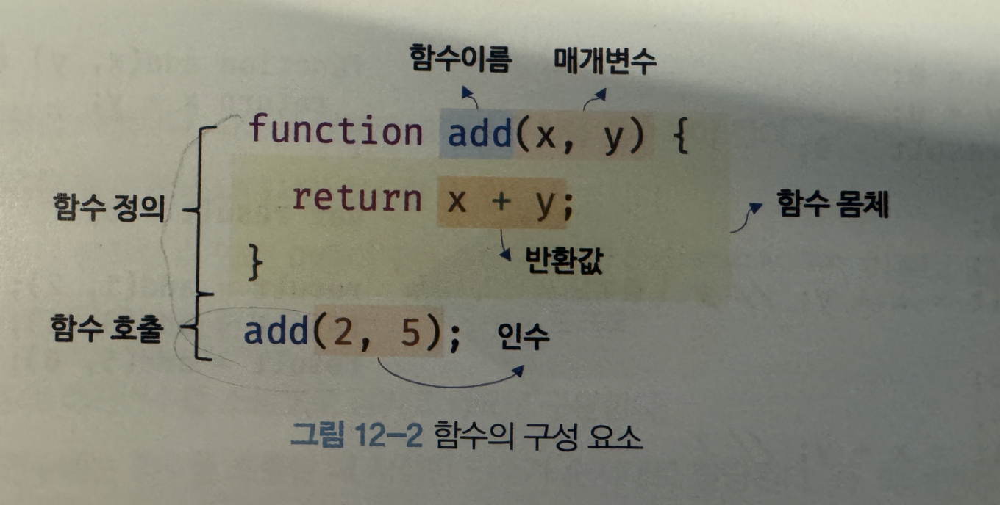
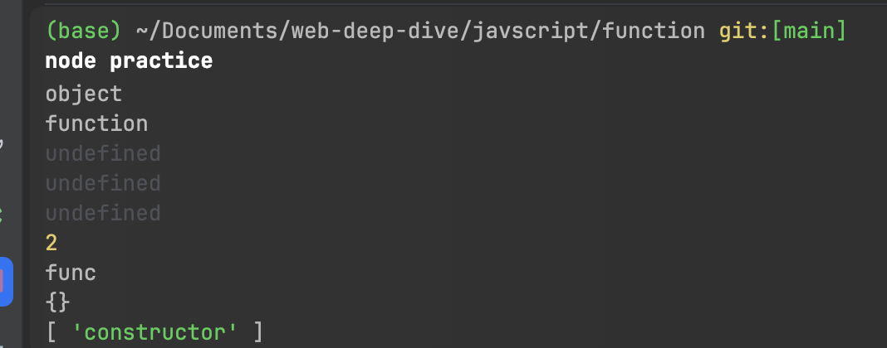
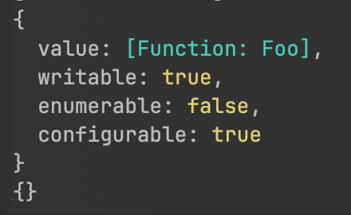
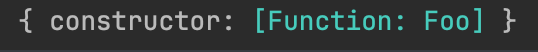

- 기초 개념 정리

  값 - 표현식이 평가 되어 생성된 결과

  변수 - 하나의 값을 저장하기 위해 확보된 메모리 공간 자체 or 그 메모리 공간을 식별하기 위해 붙인 이름

  표현식 - 값으로 평가될 수 있는 문 statement. 표현식이 평가되면 새로운 값을 생성하거나 기존 값을 참조

  문 - 프로그램을 구성하는 기본 단위이자 실행 단위. 문의 집합 → 프로그램, 문 작성, 순서에 맞게 나열한 것 → 프로그래밍

  ex) 선언문, 할당문, 조건문, 반복문 등

  토큰 - 문법적인 의미를 가지며, 문법적으로 더 이상 나눌 수 없는 코드의 기본 요소

  표현식인 문과 표현식이 아닌 문

  표현식인 문은 값으로 평가 될 수 있는 문, 표현식이 아닌 문은 값으로 평가될 수 없는 문

  리터럴? → 값을 생성하기 위한 표기법. 사람이 이해할 수 있는 무자 또는 약속된 기호를 사용해 값을 생성하는 것


## 함수

일련의 과정을 문으로 구현하고 코드 블록으로 감싸 하나의 실행 단위로 정의한 것

자바스크립트에서 함수는 스코프, 실행 컨텍스트, 클로저, 생성자 함수에 의한 객체 생성, 메서드, this, 프로토타입, 모듈화 등과 깊은 관련이 있음



이러한 함수는 **함수 정의**를 통해 생성하며 함수를 정의하는 방식은 4가지가 있음

정의를 통해 생성한 함수를 함수 호출을 통해 함수를 실행시키고 경우에 따라 반환값을 반환

## 함수를 사용하는이유?

- 코드의 재사용성
- 유지보수의 편의성
- 코드의 신뢰성
- 코드의 가독성

## 함수 리터럴

JS에서 함수는 객체 타입의 값. 다른 값, 객체와 마찬가지로 함수 리터럴로 생성 가능

함수 리터럴의 구성 - function 키워드, 함수 이름, 매게 변수 목록, 함수 몸체

```jsx
var foo = function bar(x, y) {
  return x + y;
};
```

**함수 이름**

- 함수 이름은 식별자. 따라서 식별자 네이밍 규칙 준수
- 함수 이름은 몸체 내에서만 참조할 수 있는 식별자
- 함수 이름은 생략 가능. 이름 있는 함수를 기명 함수, 이름 없는 함수를 무명/익명 함수

**매개 변수 목록**

- 0개 이상의 매개변수를 소괄호로 감싸고 쉼표로 구분
- 각 매개변수에는 함수를 호출할 때 지정한 인수가 순서대로 할당. 따라서 매개변수 목록은 순서에 의미가 있음
- 매개변수는 함수 몸체 내에서 변수와 동일하게 취급. 따라서 식별자 네이밍 규칙 준수

**함수 몸체**

- 함수가 호출되었을 때 일괄적으로 실행될 문들을 하나의 실행 단위로 정의한 코드 블록
- 함수 몸체는 함수 호출에 의해 실행

위 예제에서 함수 리터럴을 변수에 할당. 함수 리터럴도 평가되어 값을 생성하며, 이 값은 객체가됨

→ 함수는 객체!

일반적인 객체와의 차이점은 객체는 호출할 수 없지만 함수는 호출할 수 있음. 그리고 일반 객체에는 없는 함수 객체만의 고유한 프로퍼티를 가짐

- **함수의 프로퍼티**


| 프로퍼티 | 설명 |
    | --- | --- |
    | length | 함수가 기대하는 매개변수의 개수. 위 예제의 경우 2 |
    | name | 함수의 이름을 문자열로 반환. 익명 함수는 자동으로 빈문자열이거나, 대입된 변수명으로 추론 |
    | prototype | 생성자 함수로 사용될 때 인스턴스가 참조하는 프로토타입 객체를 가리킴. 일반 객체에는 존재 x |
    | arguments | 함수 실행 시 전달된 인수를 유사 배열 객체로 담음. 단, 현재 실행 중인 함수 내부에서만 접근 가능 |
    | caller | 현재 함수를 호출한 함수를 참조. 디버깅 용도로만 사용 |
    | [[Call]] (내부 슬롯) | 함수 객체만 가지고 있는 호출 가능한 내부 메커니즘. 이 덕분에 함수는 ()로 실행할 수 있음 |
    | [[Construct]] (내부 슬롯) | 생성자 함수인 경우 new와 함께 호출할 때 동작하는 내부 메서드. 일반 객체에는 없음 |
    

함수도 객체이나 일반 객체에는 없는 전용 프로퍼티를 가지며, 이 중 [[Call]], [[Construct]] 가 있어 호출 가능한 객체가 되는 것
    
```jsx
    const obj = {};
    const func = function (a, b) {
      return a + b;
    };
    
    console.log(typeof obj);   // "object"
    console.log(typeof func);  // "function"
    
    // 일반 객체에는 없음
    console.log(obj.length);   // undefined
    console.log(obj.name);     // undefined
    console.log(obj.prototype); // undefined
    
    // 함수 객체에는 있음
    console.log(func.length);  // 2
    console.log(func.name);    // "func"
    console.log(func.prototype); // { constructor: f }
    console.log(Object.getOwnPropertyNames(func.prototype)); // [ 'constructor' ]
    
```
    

    
여기서 func.prototype이 콘솔 출력시 {}로 나오는 이유는 실제 비어있는 객체가 아니라 아무 프로퍼티도 직접적으로 추가되지 않은 객체라서 그럼. 내부에는 constructor 프로퍼티가 있으나 콘솔에는 바로 보이지 않거나 축약되어 {}로 표시
    
`Object.getOwnPropertyNames(func.prototype)` 를 통해 확인 가능
    
**왜 보이지 않나?**
    
prototype 객체는 다음과 같이 생성됨
    
    ```jsx
    func.prototype = { constructor: func }
    
    // 그런데 constructor 프로퍼티의 속성(Descriptor)는 다음과 같음
    {
      writable: true,
      configurable: true,
      enumerable: false  // ← 이게 핵심
    }
    ```
 enumerable 값이 false → 열겨 되지 않아서 보이지 않음
    
    ```
    function Foo() {}
    
    console.log(Object.getOwnPropertyDescriptor(Foo.prototype, 'constructor'));
    console.log(Foo.prototype);
    ```
    
 
    
    ```jsx
    Object.defineProperty(Foo.prototype, 'constructor', {
      enumerable: true
    });
    console.log(Foo.prototype);
    ```


    
    중요한 건 이런 내용은 투머치하다! 이런게 있네 하고 넘어가면 좋을 듯하다!~


## 함수 정의

함수를 호출하기 전 인수를 전달받을 매개변수와 실행한 문들, 그리고 반환할 값을 지정하는 것

정의된 함수는 JS 엔진에 의해 평가되어 함수 객체가 됨

함수를 정의하는 방법에는 4가지

### 함수 선언문

```jsx
function add(x, y) {
  return x + y;
}

console.log(add) // [Function add]

console.log(add(2, 5)) // 7
```

함수 리터럴과 형태가 동일하나 함수 리터럴은 함수 이름 생략가능. 함수 선언문은 생략 불가

함수 선언문은 표현식이 아닌 문.  표현식이 아닌 문은 변수에 할당 불가. 함수 선언문도 변수에 할당할 수 없음

but 다음 예제에선 할당되는 것처럼 보임

```jsx
var sum = function sum(...args) {
  return args.reduce((a, b) => a + b, 0);
};

console.log(sum(1, 2, 3, 4, 5)); // 15
```

코드 문맥에 따라  2가지 경우로 해석

1. 동일한 함수 리터럴을 표현식이 아닌 문인 함수 선언문으로 해석하는 경우
2. 표현식인 문인 함수 리터럴 표현식으로 해석하는 경우

함수 선언문은 함수 이름을 생략할 수 없다 → 이것을 제외하면 함수 리터럴과 형태 동일

함수 이름이 있는 기명 함수 리터럴 → 함수 선언문 또는 함수 리터럴 표현식으로 해석될 가능성 있음

함수 이름이 없으면 익명 함수 리터럴

<aside>
💡

코드 문맥에 따라 해석이 달라지는 경우

`{}`  을 예로 들면

코드 문맥에 따라 블록문일 수 있고 객체 리터럴로 해석할 수 있음. 이것은 코드의 문맥에 따라 달라짐

`{ }`  단독으로 존재한다면 블록문으로 해석

`{ }`  값으로 평가되어야 할 문맥이라면? 연산자의 우변에서 할당한다던가 라면 객체 리터럴로 해석. 즉 피연산자로 할당된 `{ }`  객체 리터럴로 해석

</aside>

- 익명 함수, 기명 함수 [function.name](http://function.name) 콘솔 출력 차이

  위 함수 리터럴에서 기명/익명함수로 다음과 같이 함수 생성

    ```jsx
    // 익명 함수 리터럴 (anonymous function literal)
    const a = function() {
      console.log('익명 함수');
    };
    
    // 기명 함수 리터럴 (named function literal)
    const b = function sayHello() {
      console.log('기명 함수');
    };
    
    console.log(a.name);
    console.log(b.name);
    ```

  

    ```jsx
    var sum = function sumByNumbers(...args) {
      return args.reduce((a, b) => a + b, 0);
    };
    console.log(sum.name)
    ```

  

  익명 함수 리터럴은 변수명인 a로 `a.name` 추론

  기명 함수 리터럴은 함수 이름인 sayHello, sumByNumbers 로 `name` 추론


1번 동일한 함수 리터럴을 표현식이 아닌 문인 함수 선언문으로 해석하는 경우

```jsx
// 전역 코드 혹은 블록 최상단
function sayHi() {
  console.log('Hello');
}

// 블록 내부 함수 선언문
{
  function greet() {
    console.log('Hi');
  }
  greet(); // ✅ 실행 가능
}
```

다음과 같은 경우는 함수 리터럴 표현식으로 해석

```jsx
// ① 대입문 (값으로 평가)
const foo = function() {};

// ② 인자로 전달
call(function() {});

// ③ 즉시 실행 함수(IIFE)
(function() { console.log('IIFE'); })();
```

### 정리하면

코드의 문맥에 따라 해석이 달라진다.

함수 리터럴을 단독으로 사용하는 경우

- 함수 선언문으로 해석

```jsx
function foo() { ... }
```

함수 리터럴이 값으로 평가되어야 하는 문맥의 경우 (피연산자로 사용하거나, 함수 리터럴을 변수에 할당하거나)

- 리터럴 표현식으로 해석

```jsx
var sum = function (...args) {
  return args.reduce((a, b) => a + b, 0);
};

call(function() {});

(function bar() { console.log('IIFE'); });

bar() // ReferenceError: bar is not defined
```

여기서 선언문으로 생성된 foo는 호출할 수 있으나 bar는 호출할 수 없음

함수 이름은 [‘함수 몸체 내부에서만 참조할 수 있는 식별자’](https://www.notion.so/12-2982b94dd63180bc9655c14e1e2ffa35?pvs=21)

→ 함수 몸체 외부에서는 함수 이름으로 함수 참조 불가

→ 함수 몸체 외부에서는 함수 이름으로 함수를 호출할 수 없다는 의미

→ 함수를 가리키는 식별자가 없다는 것

따라서 bar 함수는 호출할 수 없음

foo는 호출할 수 있음

```jsx
function foo() { ... }
```

이 경우 자바스크립트 엔진이 암묵적으로 foo 함수 객체를 가리키는 식별자 생성 (식별자 foo를 선언하지도 할당하지도 않았지만)

즉, 함수 이름과 동일한 이름의 식별자를 자바스크립트 엔진은 암묵적으로 생성하고, 함수 객체를 할당

<aside>
💡

함수의 호출

함수는 함수 이름으로 호출하는 것이 아니라 함수 객체를 가리키는 식별자로 호출

함수 선언문으로 생성한 함수를 호출한 것은 함수 이름 `foo`가 아니라 JS엔진이 암묵적으로 생성한 식별자 `foo`

```jsx
var sum = function sumByNumbers(...args) {
  console.log(sumByNumbers === sum) // true
  return args.reduce((a, b) => a + b, 0);
};

// 함수 객체를 가리키는 식별자 sum을 통해 함수 호출
console.log(sum(1, 2, 3, 4, 5)); // 15

// 함수 이름 sumByNumbers는 함수 내부에서만 유효한 내부 식별자
// 외부에서는 식별자 sum을 통해서만 함수 객체 호출
// 함수 객체를 가리키는 외부 식별자는 sum
console.log(sumByNumbers(1, 2, 3, 4, 5)); // ReferenceError: sumByNumbers is not defined
```

</aside>

### 함수 표현식

```jsx
var add = function (x, y) {
  return x + y;
};
```

값의 성질을 갖는 객체 → 일급 객체

자바스크립트 함수 → 일급 객체

⇒ 함수를 값처럼 자유롭게 사용할 수 있다

⇒ 함수는 일급 객체이기 때문에 함수 리터럴로 생성한 함수 객체를 변수에 할당할 수 있다.

> 이러한 정의 방식을 **함수 표현식**이라 한다.
>

```jsx
// 익명 함수 리터럴을 변수에 할당한 함수 표현식
var add = function (x, y) {
  return x + y;
};

// 기명 함수 리터럴을 변수에 할당한 함수 표현식
var sum = function sumByNumbers(...args) {
  console.log(sumByNumbers === sum); // true
  return args.reduce((a, b) => a + b, 0);
};

// 얘 자체는 함수 리터럴 
// 실행하면 자스 엔진은 문으로 판단하여 함수 이름을 요구하고
// 이름이 없어 에러 발생
// SyntaxError: Function statements require a function name
function (x, y) {
  return x + y;
};

// 이 자체는 함수 리터럴 문법
// 하지만 단독으로 실행될 때는 문 위치에 있기 때문에
// 자스 엔진이 함수 선언문으로 해석
// 따라서 함수 이름 반드시 필요
function add(x, y) {
  return x + y;
};

=> 맥락에 따라 해석이 달라진다!(너무 이해하기 어려웠음 ㅠ)
```

```jsx
// 함수 선언문 add
function add(x, y) {
  return x + y;
}

// 함수 표현식으로 바꾼 add
var add = function (x, y) {
  return x + y;
}
```

- 함수 리터럴의 함수는 이름 색량 가능
- 일반적으로 함수 표현식의 함수 리터럴은 함수 이름 생략

### 함수 생성 시점과 함수 호이스팅

함수 선언문 과 함수 표현식은 비슷하나 동일하게 동작하지 않음

**함수 선언문**

- 표현식이 아닌 문
- 함수 선언문 이전 호출 가능

**함수 표현식**

- 표현식인 문
- 함수 선언문 이전 호출 불가능

⇒ 생성 시점이 다르다

<aside>
💡

**함수 선언문의 생성 (함수 호이스팅)**

함수 선언문은 런타임 이전 함수 객체가 먼저 생성 → 함수 이름과 동일한 이름 식별자 암묵적 생성 → 생성된 함수 객체 할당

런타임에는 이미 함수 객체가 생성되어 있고, 함수 이름과 동일한 식별자에 할당 완료된 상태

함수 선언문 이전 함수를 참조할 수 있으며 호출도 가능

⇒ 함수 호이스팅 - 함수 선언문이 코드의 선두로 끌어 올려진 것처럼 동작하는 JS 고유 특징

</aside>

- 함수 vs 변수 호이스팅 차이

  모두 런타임 이전 먼저 JS엔진에 의해 식별자 생성

  차이점은,

  var 변수는 undefined로 초기화됨

  함수 선언문을 통해 생성된 식별자는 함수 객체로 초기화됨

  →

  변수 선언문 이전 변수를 참조하면 변수 호이스팅에 의해 undefined로 평가

  함수 선언문으로 정의한 함수를 함수 선언문 이전에 호출 시 함수 호이스팅에 의해 호출 가능


<aside>
💡

**함수 표현식의 경우 (변수 호이스팅 발생)**

변수 할당문의 값은 할당문이 실행되는 시점 → 런타임에 평가

함수 표현식의 함수 리터럴도 할당문이 실행되는 시점에 평가되어 함수 객체가 됨

⇒ 함수 호이스팅 x, 변수 호이스팅 발생

</aside>

### Function 생성자 함수

```jsx
var add = new Function('x', 'y', 'return x + y');
```

JS에서 제공하는 빌트인 함수 Function 생성자 함수

생성자 함수에 매개변수 목록과 함수 몸체를 문자열로 전달

new 연산자와 함께 호출 시 함수 객체를 생성해 반환

new 없어도 동일하긴 함

이 방식 권장하지 않음

클로저 생성안함. 함수 선언문이나 함수 표현식으로 생성한 함수와 다르게 동작

```jsx
// 같은 렉시컬 스코프의 a 캡쳐 -> 클로저 형성
var add1 = (function () {
  var a = 10;
  return function (x, y) {
    return x + y + a;
  }
}());

console.log(add1(1, 2));

var add2 = (function () {
  var a = 10;
  // 전역 스코프에서 생성 -> 즉시 실행 함수 내의 var a... 찾을 수 없음
  return new Function('x', 'y', 'return x + y + a;');
}());

console.log(add2(1, 2)); // ReferenceError: a is not undefined
```

### 화살표 함수(ES6)

```jsx
var add = (x, y) => x + y;
```

ES6에 도입된 함수 선언 방식

항상 익명 함수로 정의

특징

- 생성자 함수로 사용 x
- 기존 함수와 this 바인딩 방식이 다름
- prototype 프로퍼티가 없음
- arguments 객체 생성 x

+ 번외 함수형 프로그래밍에서 순수함수의 중요성

```jsx
var count = 0;

function increase(n) {
  return ++n;
}

// 순수 함수가 반환한 결과값을 변수에 재할당해 상태를 변경
count = increase(count);
// 외부 상태 값을 변경시키지 않음
console.log(increase(count));
console.log(count);
count = increase(count);
console.log(count);

// 비순수 함수
// 외부 상태에 따라 반환 값이 달라짐
// 외부 상태에 의존하는 함수
function increase2() {
  return ++count;
}
```

비순수 함수의 경우 함수가 외부 상태를 변경하면 상태 변화를 추적하기 어려워짐

따라서 상태 변화를 지양하는 순수 함수를 사용하는 것이 좋음
